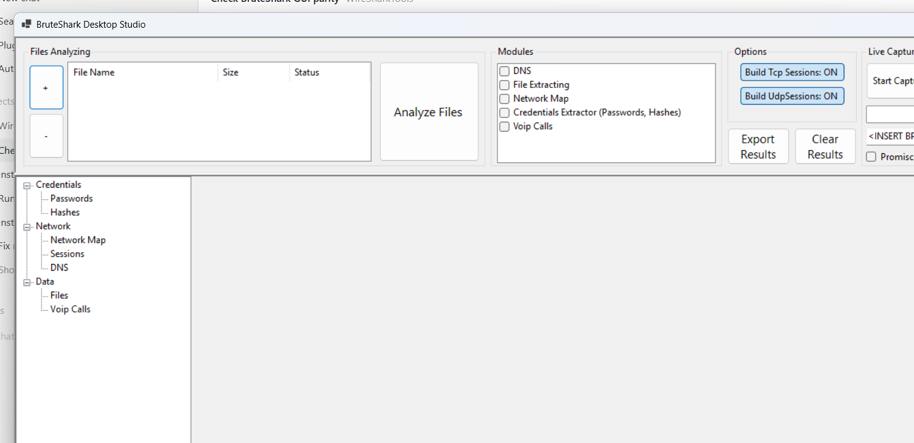
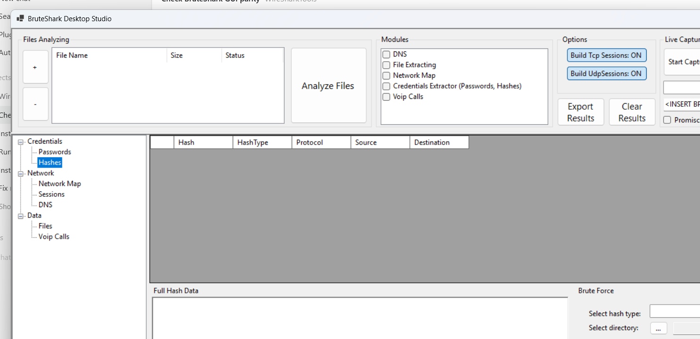

# BruteShark Studio

BruteShark Studio is a desktop-focused network forensic analysis toolkit for inspecting packet captures, extracting credentials and hashes, reconstructing sessions, exporting evidence, and launching Hashcat against supported hashes from the GUI or CLI.

Repository: <https://github.com/Ayman-Elbanhawy/BruteSharkStudio>

Full help manual: [`docs/BruteSharkStudioHelp.html`](./docs/BruteSharkStudioHelp.html)

## Download

- Repo download page: <https://github.com/Ayman-Elbanhawy/BruteSharkStudio>
- Installer ZIP in this repository: [`release/BruteSharkDesktopStudioInstaller.zip`](./release/BruteSharkDesktopStudioInstaller.zip)
- GitHub ZIP download after push: <https://github.com/Ayman-Elbanhawy/BruteSharkStudio/blob/main/release/BruteSharkDesktopStudioInstaller.zip?raw=1>

The installer is packaged as a ZIP so the public repository hosts a compressed installer artifact instead of exposing a direct executable-style download.

## Highlights

- Analyze `.pcap` and `.pcapng` captures from the desktop application or CLI
- Extract passwords, authentication hashes, files, DNS data, VoIP calls, and network topology
- Reconstruct both TCP and UDP sessions
- Export supported hashes in Hashcat format
- Crack extracted hashes directly from the desktop hashes view
- Bundle Hashcat in the Windows installer and add it to PATH for the installed environment

## Applications

- `BruteShark Desktop Studio`
  Windows WinForms application for interactive investigation
- `BruteShark Desktop Studio CLI`
  Command-line workflow for batch processing and automation
- `BruteShark Studio Wireshark Plugin`
  Optional Wireshark bridge that launches the CLI out of process

## Screenshots

### Main Window


### Hashcat Workflow


## Features

### Credentials and Hashes

- Extract usernames and passwords from supported clear-text protocols
- Extract authentication hashes including NTLM, Kerberos, CRAM-MD5, and HTTP Digest
- Export hashes into ready-to-use Hashcat input files
- Launch Hashcat directly from the desktop hashes view with:
  - optional executable override
  - custom wordlist
  - extra Hashcat arguments
  - recovered output review after the run completes

### Network Analysis

- Build a visual network map from observed endpoints and connections
- Track DNS mappings and export them for external analysis
- Reconstruct TCP and UDP sessions for protocol review and file carving

### Evidence Extraction

- Carve supported files from reconstructed traffic
- Extract and export VoIP calls
- Export consolidated investigation results to disk

## Hashcat Support

BruteShark Studio supports direct export and cracking for the following Hashcat modes:

| Hash Type | Hashcat Mode |
| --- | ---: |
| HTTP Digest | 11400 |
| CRAM-MD5 | 16400 |
| NTLMv1 | 5500 |
| NTLMv2 | 5600 |
| Kerberos AS-REQ etype 23 | 7500 |
| Kerberos AS-REP etype 23 | 18200 |
| Kerberos TGS-REP etype 23 | 13100 |
| Kerberos TGS-REP etype 17 | 19600 |
| Kerberos TGS-REP etype 18 | 19700 |

The Windows installer stages Hashcat under the application install folder and appends that Hashcat folder to the machine PATH during elevated installation.

## Build

From the repository root:

```powershell
$env:DOTNET_CLI_HOME = "$PWD\\.dotnet-home"
dotnet build .\BruteSharkStudio\PcapProcessor.sln -v:minimal
```

### Run the Desktop Application

```powershell
dotnet run --project .\BruteSharkStudio\BruteSharkDesktop\BruteSharkDesktop.csproj
```

### Run the CLI Help

```powershell
dotnet run --project .\BruteSharkStudio\BruteSharkCli\BruteSharkCli.csproj -- --help
```

### Build the Windows Installer

```powershell
dotnet msbuild .\BruteSharkStudio\BruteSharkDesktopInstaller\BruteSharkDesktopInstaller.wixproj /t:Build /p:Configuration=Debug /p:Platform=x86 /v:minimal
```

Installer output:

```text
BruteSharkStudio\BruteSharkDesktopInstaller\bin\Debug\BruteSharkDesktopStudioInstaller.msi
```

Packaged repository download:

```text
release\BruteSharkDesktopStudioInstaller.zip
```

## Desktop Usage

1. Launch `BruteShark Desktop Studio`
2. Add one or more capture files
3. Select the modules you want to run
4. Decide whether TCP and UDP session reconstruction should remain enabled
5. Click `Run`
6. Review results in the left-side module tree
7. Open the `Hashes` view to export Hashcat input or run `Crack with Hashcat`

### Hashcat Workflow in the GUI

1. Open the `Hashes` node after analysis completes
2. Pick a hash type from the list
3. Choose an output folder
4. Optionally override the bundled Hashcat executable
5. Select a wordlist
6. Optionally add extra Hashcat arguments
7. Click `Crack with Hashcat`

## CLI Usage

Print help:

```powershell
BruteSharkDesktopStudioCli --help
```

Process a directory and export results:

```powershell
BruteSharkDesktopStudioCli -m Credentials,NetworkMap,FileExtracting,DNS -d C:\Captures -o C:\Results
```

Run Hashcat after extracting hashes:

```powershell
BruteSharkDesktopStudioCli -m Credentials -d C:\Captures -o C:\Results --hashcat-wordlist C:\Wordlists\rockyou.txt
```

Use a specific Hashcat binary:

```powershell
BruteSharkDesktopStudioCli -m Credentials -d C:\Captures -o C:\Results --hashcat-path C:\Tools\hashcat\hashcat.exe --hashcat-wordlist C:\Wordlists\rockyou.txt
```

## Repository Layout

```text
BruteSharkStudio\
  BruteSharkStudio\              Solution and source projects
  BruteSharkPlugin\             Wireshark integration
  Pcap_Examples\                Example capture files
  readme_media\                 README images and screenshots
```

## GitHub Preparation Notes

This repository is set up for a `main` branch on GitHub at:

<https://github.com/Ayman-Elbanhawy/BruteSharkStudio>

Recommended first push:

```powershell
git init
git branch -M main
git remote add origin https://github.com/Ayman-Elbanhawy/BruteSharkStudio.git
git add .
git commit -m "Initial BruteShark Studio import"
git push -u origin main
```

## Support and Updates

- GitHub issues: <https://github.com/Ayman-Elbanhawy/BruteSharkStudio/issues>
- Releases: <https://github.com/Ayman-Elbanhawy/BruteSharkStudio/releases>

## Copyright

Code updates and maintenance in this repository are identified in the updated source files as:

`Ayman Elbanhawy (c) Softwaremile.com`
